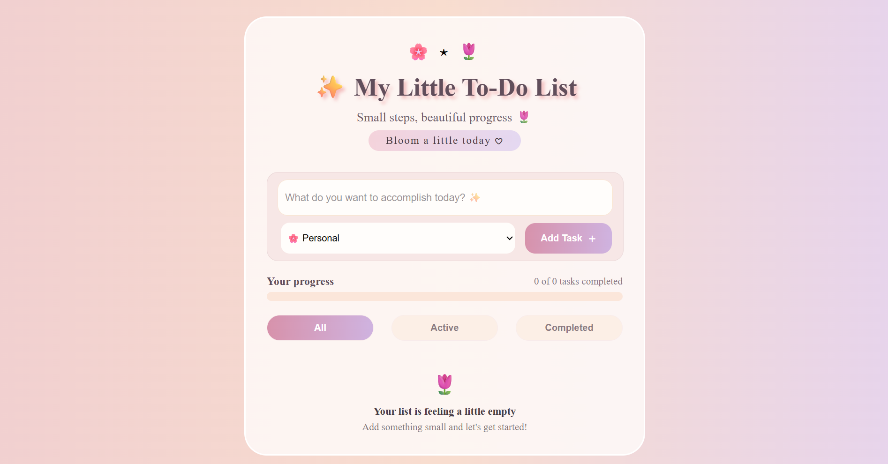
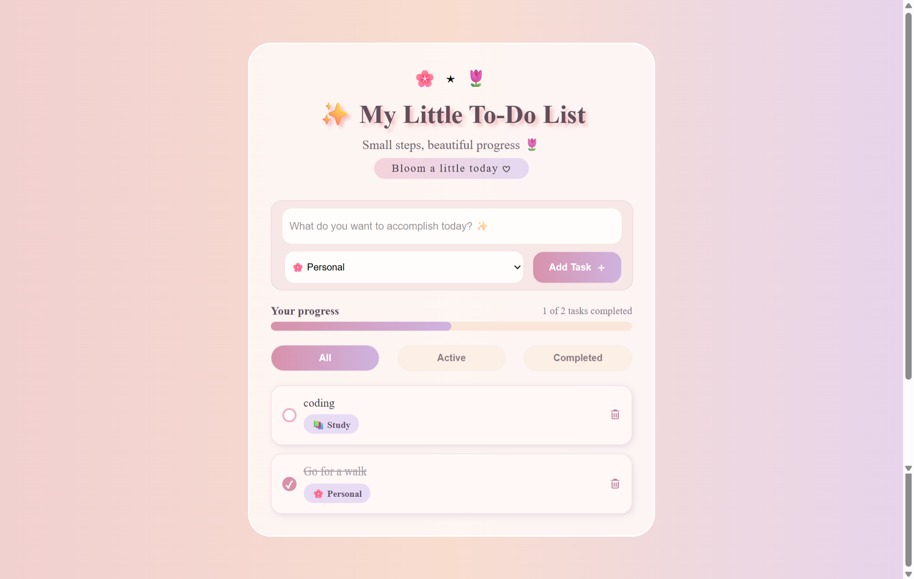

# 🌷 My Little To-Do List

A cute, aesthetic to-do list web app built with HTML, CSS, and JavaScript 
as a personal practice project to strengthen my core JavaScript concepts.

## Features
- Add tasks with a category (Personal, Study, Work, Other)
- Mark tasks as complete/active with a custom checkbox
- Delete tasks
- Filter tasks by All, Active, or Completed
- Live progress bar showing completed vs total tasks
- Tasks persist after refresh using **localStorage**
- Empty state message when no tasks are added

## JS Concepts Practiced
- DOM manipulation (creating & appending elements dynamically)
- Event listeners (click events, event delegation)
- Array methods (`filter`, `splice`, `push`)
- Local Storage (`getItem`, `setItem`, `JSON.stringify` / `JSON.parse`)
- Conditional rendering based on task status and filters

## Technologies Used
- HTML5
- CSS3
- JavaScript
- Font Awesome (icons)

## Preview

## Author
Sehar Waseem  
Software Engineering Student
